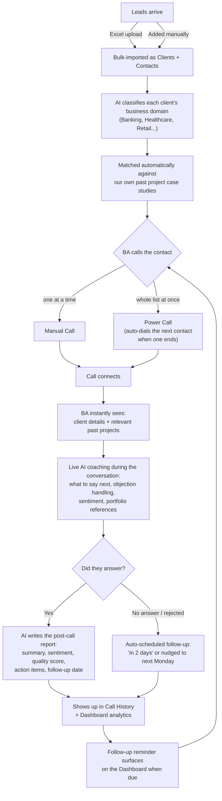
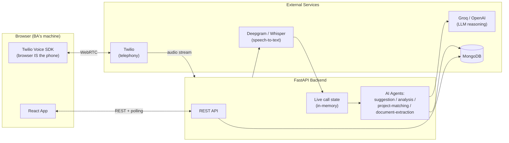

# OutboundAI — Project Overview

> A plain-language walkthrough of why this exists, what it does, and how it works — for anyone on the team, technical or not. For deep engineering detail (sequence diagrams, DB schema, code paths), see `TECHNICAL_OVERVIEW.md`.

---

## 1. The Business Problem

Outbound sales/BA teams making cold and warm calls run into the same set of problems, over and over:

| Problem | What it costs the business |
|---|---|
| **No live support during the call.** Once a Business Agent (BA) is on the phone, they're on their own — no one is coaching them, tracking objections, or reminding them what to say next. | Inconsistent call quality. New BAs perform far worse than experienced ones. |
| **Generic pitches.** A BA talking to a banking prospect has no easy way to know "have we actually solved this exact problem before?" — so they fall back to generic claims instead of citing real past work. | Weaker credibility, lower conversion. |
| **Manual dialing.** Working through a list of 50 leads means clicking "Call", waiting, hanging up, clicking the next one — one at a time, with no memory of what happened on the last call. | Wasted time between calls, lower call volume per day. |
| **Leads fall through the cracks.** If a call goes unanswered, there was previously *no record at all* of who to call back or when. | Leads silently die instead of getting a scheduled follow-up. |
| **No institutional memory.** Company case studies and past projects live in someone's head or a forgotten folder, not somewhere a BA can search mid-call. | The company's own track record isn't being used to win new business. |
| **Post-call work is manual.** Summarizing what happened, deciding if a follow-up is needed, scoring call quality — all of this used to require a human to do it by hand after every call. | Analysis either doesn't happen, or eats into time that should go to the next call. |

## 2. The Solution

OutboundAI turns a browser into a complete AI-assisted calling desk. It doesn't just place calls — it actively helps the BA *during* the call, automatically documents *after* the call, and increasingly knows *what to say* by drawing on the company's own project history.

In one sentence: **select contacts, click call (or power-call through a whole list), get live AI coaching and instant client context while you talk, and walk away with an auto-generated summary, quality score, and follow-up date — every time, without extra effort.**

## 3. How It Works — Business Flow

**Reading this as a business owner:** every single call — answered or not — ends with a documented outcome and a next action. Nothing requires a human to remember to follow up; the system schedules it. And every call benefits from the company's accumulated project history being surfaced automatically, not left to whatever the BA happens to remember.

## 4. How It Works — Technical Flow (simplified)

**Reading this as an engineer:** the browser is the phone (via Twilio's Voice SDK) — there's no server-side call placement for the BA-initiated flow. The backend's job is to stream audio to a speech-to-text provider, keep a live transcript in memory, and run a set of small, purpose-built AI agents (not one monolithic prompt) against that transcript and the company's own project data. Full sequence diagrams for the call lifecycle, transcription pipeline, and post-call analysis pipeline are in `TECHNICAL_OVERVIEW.md`.

## 5. Features

### Contacts & Clients
- Full contact CRUD (add, **edit**, delete, search) in table or card view.
- **Bulk Excel import** — upload a spreadsheet of `Client Name / Company Details / Project / Contact Number`; rows are validated, deduplicated by phone, and turned into callable contacts automatically.
- Imported clients are **domain-classified by AI** (Banking, Healthcare, Retail, Logistics, etc.) from their name/company/project description.

### Calling
- **Manual calling** — one click, browser-based (mic + speakers, no desk phone).
- **Power Calling** — select any number of contacts, hit Start, and the app dials through the list automatically: answered → normal call screen; not answered/rejected → auto-advances to the next contact with zero clicks. Includes pause/resume, skip, and an end-of-session summary.
- **Live transcription** during the call (Deepgram streaming, with a Whisper-based fallback).

### AI During the Call
- **Client Details panel** — contact info and any matched past-project context shown *immediately* on connect, not gated behind anything.
- **Live coaching suggestions** — next talking point, objection handling, live sentiment, key insight, refreshed automatically as the conversation progresses.
- **"From Our Portfolio" recommendations** — when the conversation calls for it, the AI surfaces a specific past project (by name, with a tailored pitch) instead of a generic claim.
- **On-the-fly project matching** — if a client's domain wasn't known in advance (blank Excel field, or never imported at all), the AI detects when they're describing their own need mid-call and searches the project repository live.

### Company Project Knowledge Base
- **Upload project documents** (PDF/DOCX case studies) — a background AI agent reads the document, then classifies domain, technologies, business problem, solution, key features, AI/ML components, and full tech stack.
- **Available Projects** — a searchable, filterable library of everything processed.
- **Knowledge Map** — an interactive, domain-grouped visual map of the whole project portfolio; click any project for full details.
- **Automatic client-to-project matching** — every imported client is matched against this library by domain, ranked by relevance.

### After the Call
- **AI-generated post-call report** for every answered call: summary, sentiment, 1–10 quality score, what went well, what to improve, action items, key discussion points — written using the client's actual name and referring to the caller as "the BA" throughout.
- **Automatic follow-up scheduling** — even for calls nobody answered, a follow-up is auto-created ("in 2 days", nudged to the next Monday if that lands on a weekend) so no lead is silently dropped.
- **Call History** — every past call, expandable to the full AI report.

### Dashboard & Reporting
- Call volume, completion/failure rates, average duration and quality score.
- Sentiment breakdown, 7-day quality trend, 30-day call volume chart.
- Top recurring action items across all calls.
- Follow-ups due today (banner) and follow-ups needed (stat card), one click to mark complete.
- On-demand AI-generated weekly performance summary.

---

*This document describes the system as actually built, not an aspirational roadmap. Last written 2026-07-09.*
