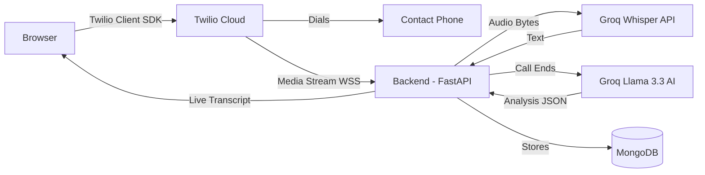
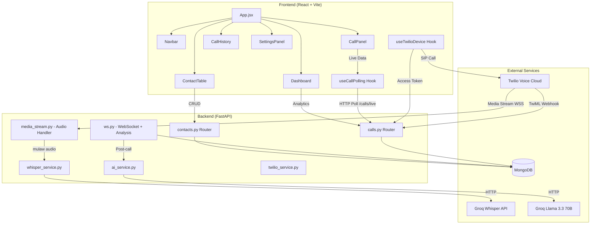
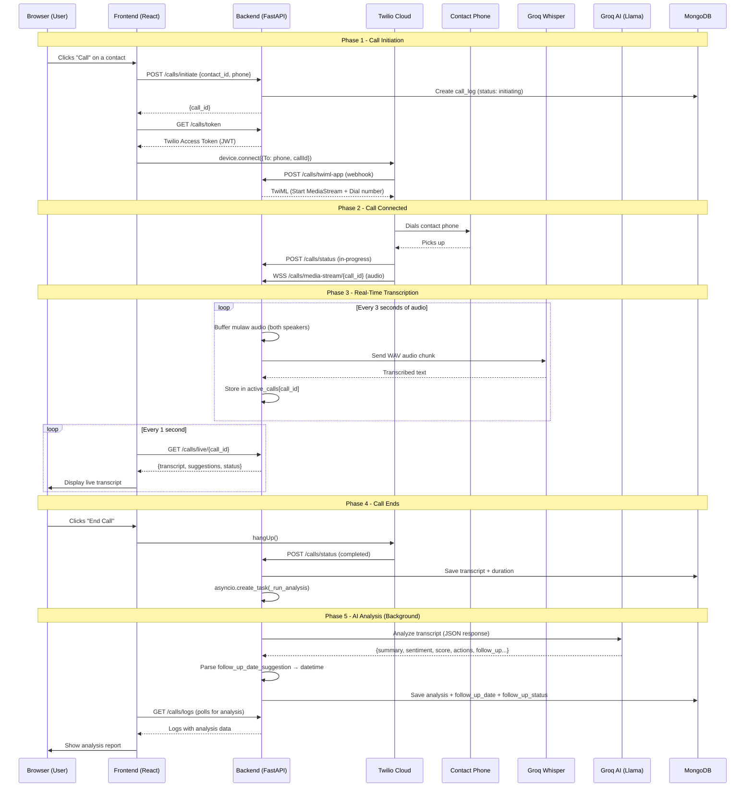
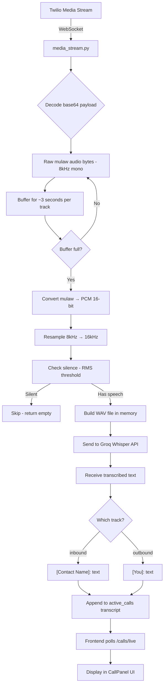
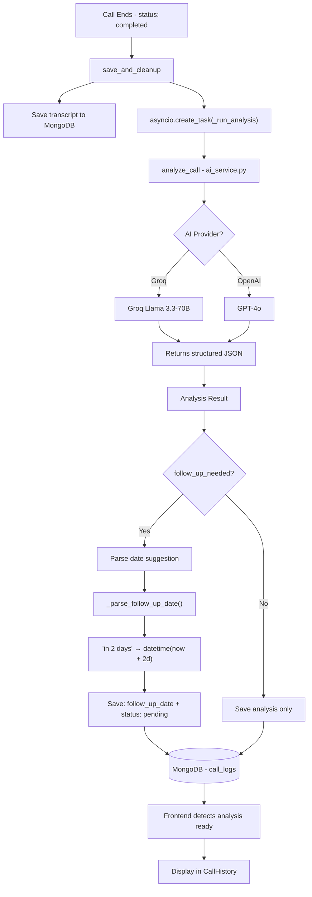
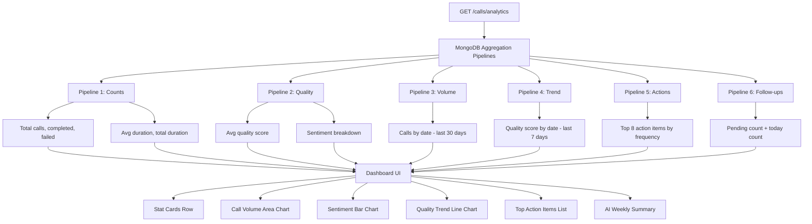

<p align="center">
  
  
  
  
  
  
</p>

# OutboundAI — Browser-Based Outbound Call Assistant

> Make outbound calls directly from your browser with **real-time AI transcription**, **post-call analysis**, **smart follow-up reminders**, and a **full analytics dashboard** — all powered by Groq AI.

---

## Features

- **Browser-Based Calling** — Make VoIP calls directly from the browser using Twilio Client SDK. No phone or softphone needed.
- **Real-Time Transcription** — Live speech-to-text powered by Groq Whisper large-v3, displayed as the call happens.
- **AI Post-Call Analysis** — Automatic call analysis with sentiment, quality score, action items, and follow-up suggestions using Llama 3.3-70B.
- **Smart Follow-Up Reminders** — AI suggests follow-up dates, the system parses them into real dates and shows reminders on your dashboard.
- **Analytics Dashboard** — Call volume charts, sentiment breakdown, quality trends, top action items, and AI-generated weekly summaries.
- **Contact Management** — Full CRUD for contacts with status tracking, call history, and notes.

---

## Demo

<!-- Add screenshots or a demo GIF here -->
<!--  -->
<!--  -->
<!--  -->

---

## Table of Contents

- [How It Works](#how-it-works)
- [Architecture](#architecture)
- [Call Flow](#call-flow---step-by-step)
- [Real-Time Transcription](#real-time-transcription-flow)
- [Post-Call AI Analysis](#post-call-ai-analysis-flow)
- [Follow-Up Reminder System](#follow-up-reminder-system)
- [Dashboard Analytics](#dashboard-analytics)
- [Tech Stack](#tech-stack)
- [Project Structure](#project-structure)
- [Getting Started](#getting-started)
- [API Reference](#api-reference)
- [Database Schema](#database-schema)
- [Environment Variables](#environment-variables)
- [Contributing](#contributing)
- [License](#license)

---

## How It Works



1. You add contacts and click **"Call"** in the browser
2. The browser uses **Twilio Client SDK** to connect the call through Twilio's cloud
3. Twilio dials the contact's phone number and streams the audio back to your server
4. Your server sends audio chunks to **Groq Whisper** for real-time speech-to-text
5. The live transcript appears in the browser as you talk
6. When the call ends, **Groq Llama 3.3-70B** analyzes the full conversation
7. You get a detailed report: sentiment, quality score, action items, follow-up suggestions
8. If AI says follow-up is needed, it schedules a reminder on your dashboard

---

## Architecture



---

## Call Flow - Step by Step

Complete lifecycle of a call from button click to analysis report.



---

## Real-Time Transcription Flow

How audio goes from a phone call to text on your screen.



### Audio Pipeline Details

| Step | What Happens | Technical Detail |
|------|-------------|-----------------|
| 1 | Twilio sends mulaw audio | 8kHz, mono, base64 encoded in JSON frames |
| 2 | Buffer accumulates ~3s | ~24,000 bytes per track (inbound/outbound) |
| 3 | Convert to PCM | `audioop.ulaw2lin()` — mulaw to 16-bit PCM |
| 4 | Resample to 16kHz | `audioop.ratecv()` — better Whisper accuracy |
| 5 | Silence detection | Skip if RMS < 0.005 (no speech) |
| 6 | Build WAV | Standard WAV header + PCM data, all in memory |
| 7 | Send to Groq | HTTP POST with `whisper-large-v3` model |
| 8 | Label speakers | inbound = contact name, outbound = "You" |

---

## Post-Call AI Analysis Flow

When a call ends, the system automatically analyzes the full conversation.



### Analysis Fields

| Field | Description | Example |
|-------|-------------|---------|
| `summary` | 2-3 sentence overview | "Discussed pricing tiers and timeline..." |
| `sentiment` | Overall call mood | Positive / Neutral / Negative |
| `quality_score` | Agent performance 1-10 | 8 |
| `went_well` | What the agent did right | ["Good rapport building"] |
| `to_improve` | Areas for improvement | ["Ask more discovery questions"] |
| `action_items` | Follow-up tasks | ["Send pricing PDF", "Schedule demo"] |
| `follow_up_needed` | Whether callback is needed | true / false |
| `follow_up_reason` | Why follow-up is needed | "Wants to discuss with team" |
| `follow_up_date_suggestion` | When to call back | "in 2 days", "next week" |
| `key_points` | Topics discussed | ["Budget: $50K", "Timeline: Q3"] |

### Follow-Up Date Parsing

| AI Suggestion | Parsed Date |
|--------------|-------------|
| "today" | Today |
| "tomorrow" | +1 day |
| "in 2 days" | +2 days |
| "next week" | +7 days |
| "in 2 weeks" | +14 days |
| "next month" | +30 days |
| _(anything else)_ | +3 days (default) |

---

## Follow-Up Reminder System

```mermaid
flowchart LR
    A[AI Analysis] -->|follow_up_needed: true| B[Parse Date]
    B --> C[Save to DB with status: pending]

    C --> D{User opens Dashboard}
    D --> E["GET /calls/follow-ups/today"]
    E --> F{Any due today/overdue?}

    F -->|Yes| G[Show amber banner on Dashboard]
    G --> H[User expands banner]
    H --> I[See contact list with reasons]
    I --> J{User action}

    J -->|Mark Done| K["POST /follow-ups/{id}/complete"]
    K --> L[Status → completed]
    L --> M[Remove from banner]

    J -->|View All| N[Open Follow-ups Modal]
    N --> O[See all pending with date badges]
    O --> P["Overdue (red) / Today (amber) / Upcoming (blue)"]
```



### How Reminders Work

1. **Dashboard banner** — If follow-ups are due today or overdue, an amber banner shows: *"You have 3 follow-ups due today"*
2. **Expand to see details** — Contact name, phone, and reason for follow-up
3. **Mark as done** — Click "Done" to complete a follow-up
4. **Follow-ups modal** — Click the Follow-ups stat card for all pending follow-ups with color-coded badges:
   - 🔴 **Overdue** — Past the scheduled date
   - 🟡 **Due today** — Scheduled for today
   - 🔵 **Upcoming** — Future date

---

## Dashboard Analytics



### AI Weekly Summary

Click **"Generate"** to get an AI summary of the week's calls — includes headline, wins, areas to improve, top priority action, and outlook.

---

## Tech Stack

### Backend

| Technology | Purpose |
|-----------|---------|
| [FastAPI](https://fastapi.tiangolo.com/) | Async web framework |
| [Motor](https://motor.readthedocs.io/) | Async MongoDB driver |
| [Twilio SDK](https://www.twilio.com/docs/voice) | Voice API, TwiML, access tokens |
| [Groq API](https://groq.com/) | Whisper STT + Llama 3.3 AI analysis |
| [OpenAI API](https://platform.openai.com/) | Alternative AI provider (GPT-4o) |

### Frontend

| Technology | Purpose |
|-----------|---------|
| [React 19](https://react.dev/) | UI framework |
| [Vite](https://vitejs.dev/) | Build tool + dev server |
| [Tailwind CSS 4](https://tailwindcss.com/) | Utility-first styling |
| [Twilio Voice SDK](https://www.twilio.com/docs/voice/sdks/javascript) | Browser-based VoIP |
| [Lucide React](https://lucide.dev/) | Icon library |

### Infrastructure

| Service | Purpose |
|---------|---------|
| [MongoDB](https://www.mongodb.com/) | Database for contacts + call logs |
| [ngrok](https://ngrok.com/) | Expose local server for Twilio webhooks |

---

## Project Structure

```
outbound/
├── backend/
│   ├── app/
│   │   ├── main.py                # FastAPI app, CORS, routers
│   │   ├── config.py              # Settings from .env
│   │   ├── database.py            # MongoDB connection
│   │   ├── models/
│   │   │   └── schemas.py         # Pydantic models
│   │   ├── routers/
│   │   │   ├── calls.py           # Call endpoints, analytics, follow-ups
│   │   │   ├── contacts.py        # Contact CRUD
│   │   │   ├── ws.py              # WebSocket, analysis, date parsing
│   │   │   └── media_stream.py    # Twilio audio stream handler
│   │   └── services/
│   │       ├── ai_service.py      # Groq/OpenAI AI functions
│   │       ├── whisper_service.py # Audio → text via Groq Whisper
│   │       └── twilio_service.py  # TwiML generation
│   ├── requirements.txt
│   └── .env                       # ⚠️ Not committed (in .gitignore)
├── frontend/
│   ├── src/
│   │   ├── App.jsx                # Main layout + routing
│   │   ├── index.css              # Tailwind theme + custom effects
│   │   ├── components/
│   │   │   ├── Navbar.jsx         # Top navigation bar
│   │   │   ├── Dashboard.jsx      # Analytics + follow-ups + weekly summary
│   │   │   ├── ContactTable.jsx   # Contact list + call initiation
│   │   │   ├── CallPanel.jsx      # Active call UI with live transcript
│   │   │   ├── CallHistory.jsx    # Call logs with AI analysis
│   │   │   └── SettingsPanel.jsx  # AI provider settings
│   │   └── hooks/
│   │       ├── useTwilioDevice.js # Twilio Device management
│   │       └── useCallPolling.js  # Live transcript polling
│   ├── index.html
│   └── package.json
├── .gitignore
└── README.md
```

---

## Getting Started

### Prerequisites

- **Python 3.10+**
- **Node.js 18+**
- **MongoDB** (local or Atlas)
- **Twilio** account with Voice enabled
- **Groq** API key ([console.groq.com](https://console.groq.com))
- **ngrok** ([ngrok.com](https://ngrok.com))

### 1. Clone the repository

```bash
git clone https://github.com/kumaresan-Ai-Dev/outbound.git
cd outbound
```

### 2. Backend setup

```bash
cd backend
python -m venv ../venv

# Activate virtual environment
# Linux/Mac:
source ../venv/bin/activate
# Windows:
..\venv\Scripts\activate

pip install -r requirements.txt
```

### 3. Frontend setup

```bash
cd frontend
npm install
```

### 4. Configure environment

Create `backend/.env` with your credentials (see [Environment Variables](#environment-variables)).

### 5. Start ngrok

```bash
ngrok http 8000
```

Copy the HTTPS URL (e.g., `https://xxxx-xx-xx.ngrok-free.app`) and set it as `BASE_URL` in your `.env`.

### 6. Configure Twilio

1. Go to **Twilio Console** → **Voice** → **TwiML Apps**
2. Create a TwiML App with Request URL: `https://your-ngrok-url/calls/twiml-app`
3. Copy the TwiML App SID to `.env` as `TWILIO_TWIML_APP_SID`
4. Create an **API Key + Secret** in Twilio Console
5. Add them to `.env`

### 7. Run the app

**Terminal 1 — Backend:**
```bash
cd backend
uvicorn app.main:app --reload --host 0.0.0.0 --port 8000
```

**Terminal 2 — Frontend:**
```bash
cd frontend
npm run dev
```

Open **http://localhost:5173** in your browser.

---

## API Reference

### Calls — `/calls`

| Method | Endpoint | Description |
|--------|----------|-------------|
| `GET` | `/calls/token` | Generate Twilio access token for browser |
| `POST` | `/calls/initiate` | Create call log, return call_id |
| `POST` | `/calls/twiml-app` | Twilio webhook — returns TwiML |
| `POST` | `/calls/status/{call_id}` | Twilio status callback |
| `GET` | `/calls/live/{call_id}` | Poll for live transcript |
| `GET` | `/calls/logs` | Get last 50 call logs with analysis |
| `GET` | `/calls/logs/{contact_id}` | Call history for a specific contact |
| `GET` | `/calls/analytics` | Dashboard aggregated metrics |
| `POST` | `/calls/weekly-summary` | AI-generated weekly summary |
| `GET` | `/calls/follow-ups` | All pending follow-ups |
| `GET` | `/calls/follow-ups/today` | Follow-ups due today or overdue |
| `POST` | `/calls/follow-ups/{call_id}/complete` | Mark follow-up as done |

### Contacts — `/contacts`

| Method | Endpoint | Description |
|--------|----------|-------------|
| `GET` | `/contacts/` | List all contacts |
| `POST` | `/contacts/` | Create new contact |
| `PUT` | `/contacts/{id}` | Update contact |
| `DELETE` | `/contacts/{id}` | Delete contact |

### WebSocket

| Endpoint | Description |
|----------|-------------|
| `WS /ws/call/{call_id}` | Frontend WebSocket for live updates |
| `WS /calls/media-stream/{call_id}` | Twilio audio stream for transcription |

---

## Database Schema

### `contacts` collection

```json
{
  "_id": "ObjectId",
  "name": "John Doe",
  "phone": "+1234567890",
  "company": "Acme Corp",
  "status": "new | called | follow_up | closed",
  "notes": "Interested in enterprise plan",
  "last_called": "2026-03-15T10:30:00Z",
  "created_at": "2026-03-10T08:00:00Z"
}
```

### `call_logs` collection

```json
{
  "_id": "ObjectId",
  "contact_id": "abc123",
  "contact_name": "John Doe",
  "phone": "+1234567890",
  "status": "completed",
  "duration": 245,
  "transcript": "[You]: Hi John...\n[John Doe]: Hello...",
  "twilio_sid": "CA...",
  "analysis": {
    "summary": "Discussed pricing and timeline...",
    "sentiment": "Positive",
    "quality_score": 8,
    "went_well": ["Good rapport", "Clear explanation"],
    "to_improve": ["Ask more questions"],
    "action_items": ["Send proposal by Friday"],
    "follow_up_needed": true,
    "follow_up_reason": "Wants to discuss with team",
    "follow_up_date_suggestion": "in 2 days",
    "key_points": ["Budget: $50K", "Timeline: Q3"]
  },
  "follow_up_date": "2026-03-18T10:30:00Z",
  "follow_up_status": "pending | completed",
  "follow_up_completed_at": null,
  "created_at": "2026-03-16T10:30:00Z"
}
```

---

## Environment Variables

Create `backend/.env`:

```env
# Twilio
TWILIO_ACCOUNT_SID=ACxxxxxxxxxxxxxxxxxxxxxxxxxxxxxxxx
TWILIO_AUTH_TOKEN=xxxxxxxxxxxxxxxxxxxxxxxxxxxxxxxx
TWILIO_PHONE_NUMBER=+1XXXXXXXXXX
TWILIO_API_KEY=SKxxxxxxxxxxxxxxxxxxxxxxxxxxxxxxxx
TWILIO_API_SECRET=xxxxxxxxxxxxxxxxxxxxxxxxxxxxxxxx
TWILIO_TWIML_APP_SID=APxxxxxxxxxxxxxxxxxxxxxxxxxxxxxxxx

# AI Providers
GROQ_API_KEY=gsk_xxxxxxxxxxxxxxxxxxxxxxxxxxxx
OPENAI_API_KEY=sk-proj-xxxxxxxxxxxxxxxx       # Optional
AI_PROVIDER=groq                               # groq or openai

# Database
MONGO_URI=mongodb://localhost:27017
MONGO_DB_NAME=outbound_calls

# Server (ngrok URL for Twilio webhooks)
BASE_URL=https://xxxx-xx-xx-xx-xx.ngrok-free.app
```

> **Note:** Never commit your `.env` file. It's already in `.gitignore`.

---

## Contributing

Contributions are welcome! Here's how:

1. Fork the repository
2. Create a feature branch (`git checkout -b feature/awesome-feature`)
3. Commit your changes (`git commit -m 'Add awesome feature'`)
4. Push to the branch (`git push origin feature/awesome-feature`)
5. Open a Pull Request

---

## License

This project is open source and available under the [MIT License](LICENSE).

---

<p align="center">
  Built with ❤️ using FastAPI, React, Twilio, and Groq AI
</p>
