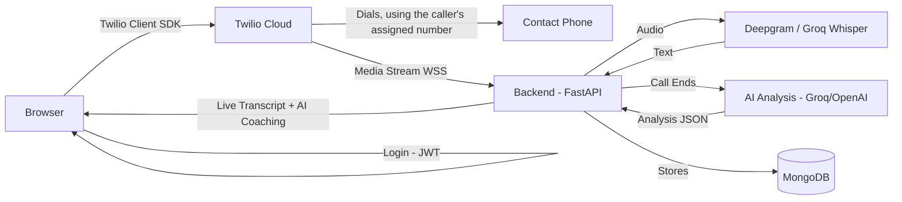
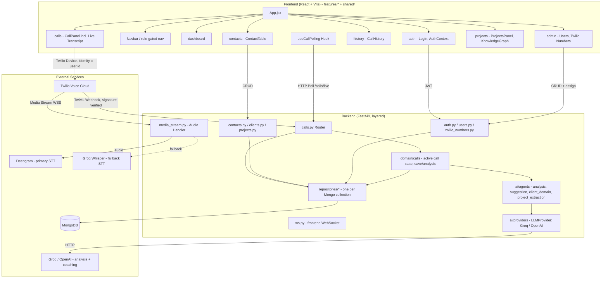
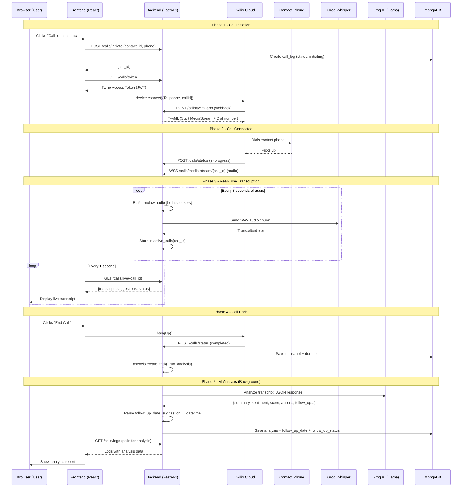
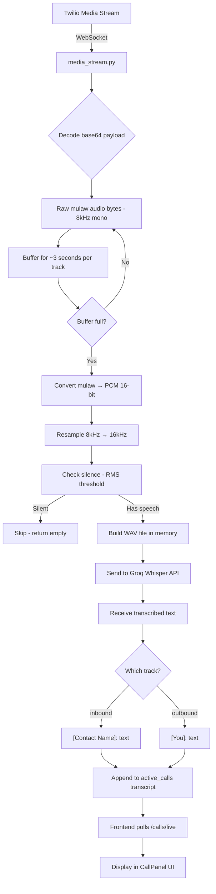
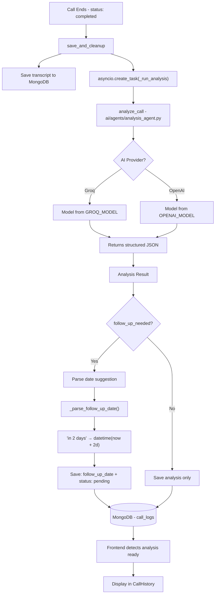
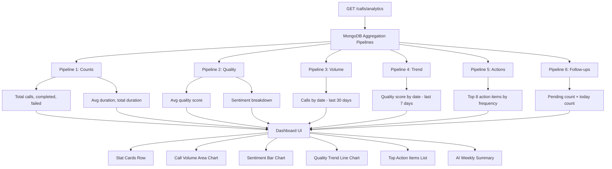

<p align="center">
  
  
  
  
  
  
</p>

# OutboundAI — Browser-Based Outbound Call Assistant

> Make outbound calls directly from your browser with **role-based auth**, **multi-number calling**, **real-time AI transcription and coaching**, **post-call analysis**, **smart follow-up reminders**, and a **full analytics dashboard** — powered by Deepgram and your choice of Groq or OpenAI.

---

## Features

- **Browser-Based Calling** — Make VoIP calls directly from the browser using Twilio Client SDK. No phone or softphone needed.
- **Role-Based Auth** — JWT login with `admin`/`sales` roles; a bootstrap admin account is created automatically on first startup.
- **Multi-Number Calling** — Admins maintain a pool of Twilio numbers and assign them (many-to-many) to sales users; each outbound call automatically uses the calling user's assigned caller ID, falling back to a default number if none is assigned.
- **Power Dialer** — Select a batch of contacts and auto-dial through them sequentially, with pause/resume/skip and automatic secondary-number retry on no-answer.
- **Real-Time Transcription** — Live speech-to-text via Deepgram streaming (falling back to batched Groq Whisper if Deepgram is unavailable), with a Live Transcript panel shown during the call.
- **In-Call AI Coaching** — Live suggestions (next talking point, objection handling, sentiment, relevant past-project recommendations) as the conversation happens.
- **AI Post-Call Analysis** — Automatic call analysis with sentiment, quality score, action items, and follow-up suggestions.
- **Smart Follow-Up Reminders** — AI suggests follow-up dates, the system parses them into real dates and shows reminders on your dashboard — including for calls nobody answered.
- **Excel Contact Import** — Bulk-import contacts from a spreadsheet, with a country-code selector applied to any number that doesn't already include one.
- **Company Project Knowledge Base** — Upload past project documents (PDF/DOCX); an AI agent extracts domain, tech stack, and summary, and matches them to imported clients for use in live coaching.
- **Analytics Dashboard** — Call volume charts, sentiment breakdown, quality trends, top action items, and AI-generated weekly summaries.
- **Contact Management** — Full CRUD for contacts with status tracking, call history, and notes.
- **Timezone-Aware Timestamps** — API responses convert stored UTC timestamps to the browser's local timezone automatically.

---

## Demo

<!-- Add screenshots or a demo GIF here -->
<!--  -->
<!--  -->
<!--  -->

---

## Table of Contents

- [How It Works](#how-it-works)
- [Architecture](#architecture)
- [Call Flow](#call-flow---step-by-step)
- [Real-Time Transcription](#real-time-transcription-flow)
- [Post-Call AI Analysis](#post-call-ai-analysis-flow)
- [Follow-Up Reminder System](#follow-up-reminder-system)
- [Dashboard Analytics](#dashboard-analytics)
- [Tech Stack](#tech-stack)
- [Project Structure](#project-structure)
- [Getting Started](#getting-started)
- [API Reference](#api-reference)
- [Database Schema](#database-schema)
- [Environment Variables](#environment-variables)
- [Contributing](#contributing)
- [License](#license)

---

## How It Works


```mermaid
flowchart LR
    A[Browser] -->|Login - JWT| A
    A -->|Twilio Client SDK| B[Twilio Cloud]
    B -->|Dials, using the caller's assigned number| C[Contact Phone]
    B -->|Media Stream WSS| D[Backend - FastAPI]
    D -->|Audio| E[Deepgram / Groq Whisper]
    E -->|Text| D
    D -->|Live Transcript + AI Coaching| A
    D -->|Call Ends| F[AI Analysis - Groq/OpenAI]
    F -->|Analysis JSON| D
    D -->|Stores| G[(MongoDB)]
```

1. You log in (JWT, `admin` or `sales` role)
2. You add/import contacts and click **"Call"** (or select several and start a **Power Dial** session)
3. The browser uses **Twilio Client SDK** to connect the call through Twilio's cloud, identified as you — the backend resolves this to your admin-assigned Twilio number as the caller ID
4. Twilio dials the contact's phone number and streams the audio back to your server
5. Your server streams audio to **Deepgram** (or Groq Whisper as a fallback) for real-time speech-to-text
6. The live transcript and in-call AI coaching suggestions appear in the browser as you talk
7. When the call ends, the configured AI provider (Groq or OpenAI) analyzes the full conversation
8. You get a detailed report: sentiment, quality score, action items, follow-up suggestions
9. If AI says follow-up is needed (or the call wasn't answered), it schedules a reminder on your dashboard

---

## Architecture

Backend code is layered: `routers/` (HTTP/WebSocket only) → `domain/` services and `ai/agents/` → `repositories/` (one per collection) → MongoDB. AI agents never talk to a Groq/OpenAI SDK directly — they go through a shared `LLMProvider` abstraction in `ai/providers/`, so switching providers or models is a settings change, not a code change.


```mermaid
graph TB
    subgraph Frontend ["Frontend (React + Vite) - features/* + shared/"]
        UI[App.jsx]
        AUTH_FE[auth - Login, AuthContext]
        NAV[Navbar / role-gated nav]
        DASH[dashboard]
        CT[contacts - ContactTable]
        CP[calls - CallPanel incl. Live Transcript]
        CH[history - CallHistory]
        ADMIN[admin - Users, Twilio Numbers]
        PROJ[projects - ProjectsPanel, KnowledgeGraph]
        POLL[useCallPolling Hook]
    end

    subgraph Backend ["Backend (FastAPI, layered)"]
        AUTHR[auth.py / users.py / twilio_numbers.py]
        CALLS[calls.py Router]
        CONTACTS[contacts.py / clients.py / projects.py]
        WS[ws.py - frontend WebSocket]
        MS[media_stream.py - Audio Handler]
        DOMAIN[domain/calls - active call state, save/analysis]
        AGENTS[ai/agents - analysis, suggestion, client_domain, project_extraction]
        PROVIDERS[ai/providers - LLMProvider: Groq / OpenAI]
        REPOS[repositories/* - one per Mongo collection]
    end

    subgraph External ["External Services"]
        TWILIO[Twilio Voice Cloud]
        DEEPGRAM[Deepgram - primary STT]
        GROQ_W[Groq Whisper - fallback STT]
        LLM[Groq / OpenAI - analysis + coaching]
        MONGO[(MongoDB)]
    end

    UI --> AUTH_FE & NAV & DASH & CT & CP & CH & ADMIN & PROJ
    AUTH_FE -->|JWT| AUTHR
    CP -->|Twilio Device, identity = user id| TWILIO
    POLL -->|HTTP Poll /calls/live| CALLS
    CT -->|CRUD| CONTACTS
    ADMIN -->|CRUD + assign| AUTHR

    TWILIO -->|TwiML Webhook, signature-verified| CALLS
    TWILIO -->|Media Stream WSS| MS
    MS -->|audio| DEEPGRAM
    MS -.fallback.-> GROQ_W
    CALLS --> DOMAIN
    DOMAIN --> AGENTS
    AGENTS --> PROVIDERS
    PROVIDERS -->|HTTP| LLM
    CALLS & CONTACTS & AUTHR & DOMAIN --> REPOS
    REPOS --> MONGO
```

---

## Call Flow - Step by Step

Complete lifecycle of a call from button click to analysis report. (All `/calls/*` REST calls below require a valid JWT; the diagram omits the `Authorization` header on each request for brevity. `GET /calls/token` mints the Twilio Access Token with your user id as its identity, which `/calls/twiml-app` later resolves back to your admin-assigned Twilio number as the caller ID.)


```mermaid
sequenceDiagram
    participant User as Browser (User)
    participant FE as Frontend (React)
    participant BE as Backend (FastAPI)
    participant TW as Twilio Cloud
    participant PH as Contact Phone
    participant GW as Groq Whisper
    participant GA as Groq AI (Llama)
    participant DB as MongoDB

    Note over User,DB: Phase 1 - Call Initiation
    User->>FE: Clicks "Call" on a contact
    FE->>BE: POST /calls/initiate {contact_id, phone}
    BE->>DB: Create call_log (status: initiating)
    BE-->>FE: {call_id}
    FE->>BE: GET /calls/token
    BE-->>FE: Twilio Access Token (JWT)
    FE->>TW: device.connect({To: phone, callId})
    TW->>BE: POST /calls/twiml-app (webhook)
    BE-->>TW: TwiML (Start MediaStream + Dial number)

    Note over User,DB: Phase 2 - Call Connected
    TW->>PH: Dials contact phone
    PH-->>TW: Picks up
    TW->>BE: POST /calls/status (in-progress)
    TW->>BE: WSS /calls/media-stream/{call_id} (audio)

    Note over User,DB: Phase 3 - Real-Time Transcription
    loop Every 3 seconds of audio
        BE->>BE: Buffer mulaw audio (both speakers)
        BE->>GW: Send WAV audio chunk
        GW-->>BE: Transcribed text
        BE->>BE: Store in active_calls[call_id]
    end
    loop Every 1 second
        FE->>BE: GET /calls/live/{call_id}
        BE-->>FE: {transcript, suggestions, status}
        FE->>User: Display live transcript
    end

    Note over User,DB: Phase 4 - Call Ends
    User->>FE: Clicks "End Call"
    FE->>TW: hangUp()
    TW->>BE: POST /calls/status (completed)
    BE->>DB: Save transcript + duration
    BE->>BE: asyncio.create_task(_run_analysis)

    Note over User,DB: Phase 5 - AI Analysis (Background)
    BE->>GA: Analyze transcript (JSON response)
    GA-->>BE: {summary, sentiment, score, actions, follow_up...}
    BE->>BE: Parse follow_up_date_suggestion → datetime
    BE->>DB: Save analysis + follow_up_date + follow_up_status
    FE->>BE: GET /calls/logs (polls for analysis)
    BE-->>FE: Logs with analysis data
    FE->>User: Show analysis report
```

---

## Real-Time Transcription Flow

How audio goes from a phone call to text on your screen. **Deepgram streaming is the primary transcription path** (near-instant, word-by-word) when `TRANSCRIPTION_PROVIDER=deepgram` and a Deepgram key is configured; the diagram below shows the **Groq Whisper fallback path**, used automatically if Deepgram is unavailable, unconfigured, or drops mid-call.


```mermaid
flowchart TD
    A[Twilio Media Stream] -->|WebSocket| B[media_stream.py]
    B --> C{Decode base64 payload}
    C --> D[Raw mulaw audio bytes - 8kHz mono]
    D --> E[Buffer for ~3 seconds per track]

    E --> F{Buffer full?}
    F -->|No| D
    F -->|Yes| G[Convert mulaw → PCM 16-bit]

    G --> H[Resample 8kHz → 16kHz]
    H --> I[Check silence - RMS threshold]

    I -->|Silent| J[Skip - return empty]
    I -->|Has speech| K[Build WAV file in memory]

    K --> L[Send to Groq Whisper API]
    L --> M[Receive transcribed text]

    M --> N{Which track?}
    N -->|inbound| O["[Contact Name]: text"]
    N -->|outbound| P["[You]: text"]

    O --> Q[Append to active_calls transcript]
    P --> Q

    Q --> R[Frontend polls /calls/live]
    R --> S[Display in CallPanel UI]
```

### Audio Pipeline Details

| Step | What Happens | Technical Detail |
|------|-------------|-----------------|
| 1 | Twilio sends mulaw audio | 8kHz, mono, base64 encoded in JSON frames |
| 2 | Buffer accumulates ~3s | ~24,000 bytes per track (inbound/outbound) |
| 3 | Convert to PCM | `audioop.ulaw2lin()` — mulaw to 16-bit PCM |
| 4 | Resample to 16kHz | `audioop.ratecv()` — better Whisper accuracy |
| 5 | Silence detection | Skip if RMS < 0.005 (no speech) |
| 6 | Build WAV | Standard WAV header + PCM data, all in memory |
| 7 | Send to Groq | HTTP POST with `whisper-large-v3` model |
| 8 | Label speakers | inbound = contact name, outbound = "You" |

---

## Post-Call AI Analysis Flow

When a call ends, the system automatically analyzes the full conversation.


```mermaid
flowchart TD
    A[Call Ends - status: completed] --> B[save_and_cleanup]
    B --> C[Save transcript to MongoDB]
    B --> D["asyncio.create_task(_run_analysis)"]

    D --> E[analyze_call - ai/agents/analysis_agent.py]
    E --> F{AI Provider?}
    F -->|Groq| G[Model from GROQ_MODEL]
    F -->|OpenAI| H[Model from OPENAI_MODEL]

    G --> I[Returns structured JSON]
    H --> I

    I --> J[Analysis Result]

    J --> K{follow_up_needed?}
    K -->|Yes| L[Parse date suggestion]
    L --> M["_parse_follow_up_date()"]
    M --> N["'in 2 days' → datetime(now + 2d)"]
    N --> O[Save: follow_up_date + status: pending]

    K -->|No| P[Save analysis only]

    O --> Q[(MongoDB - call_logs)]
    P --> Q

    Q --> R[Frontend detects analysis ready]
    R --> S[Display in CallHistory]
```

### Analysis Fields

| Field | Description | Example |
|-------|-------------|---------|
| `summary` | 2-3 sentence overview | "Discussed pricing tiers and timeline..." |
| `sentiment` | Overall call mood | Positive / Neutral / Negative |
| `quality_score` | Agent performance 1-10 | 8 |
| `went_well` | What the agent did right | ["Good rapport building"] |
| `to_improve` | Areas for improvement | ["Ask more discovery questions"] |
| `action_items` | Follow-up tasks | ["Send pricing PDF", "Schedule demo"] |
| `follow_up_needed` | Whether callback is needed | true / false |
| `follow_up_reason` | Why follow-up is needed | "Wants to discuss with team" |
| `follow_up_date_suggestion` | When to call back | "in 2 days", "next week" |
| `key_points` | Topics discussed | ["Budget: $50K", "Timeline: Q3"] |

### Follow-Up Date Parsing

| AI Suggestion | Parsed Date |
|--------------|-------------|
| "today" | Today |
| "tomorrow" | +1 day |
| "in 2 days" | +2 days |
| "next week" | +7 days |
| "in 2 weeks" | +14 days |
| "next month" | +30 days |
| _(anything else)_ | +3 days (default) |

---

## Follow-Up Reminder System


```mermaid
flowchart LR
    A[AI Analysis] -->|follow_up_needed: true| B[Parse Date]
    B --> C[Save to DB with status: pending]

    C --> D{User opens Dashboard}
    D --> E["GET /calls/follow-ups/today"]
    E --> F{Any due today/overdue?}

    F -->|Yes| G[Show amber banner on Dashboard]
    G --> H[User expands banner]
    H --> I[See contact list with reasons]
    I --> J{User action}

    J -->|Mark Done| K["POST /follow-ups/{id}/complete"]
    K --> L[Status → completed]
    L --> M[Remove from banner]

    J -->|View All| N[Open Follow-ups Modal]
    N --> O[See all pending with date badges]
    O --> P["Overdue (red) / Today (amber) / Upcoming (blue)"]
```

### How Reminders Work

1. **Dashboard banner** — If follow-ups are due today or overdue, an amber banner shows: *"You have 3 follow-ups due today"*
2. **Expand to see details** — Contact name, phone, and reason for follow-up
3. **Mark as done** — Click "Done" to complete a follow-up
4. **Follow-ups modal** — Click the Follow-ups stat card for all pending follow-ups with color-coded badges:
   - 🔴 **Overdue** — Past the scheduled date
   - 🟡 **Due today** — Scheduled for today
   - 🔵 **Upcoming** — Future date

---

## Dashboard Analytics


```mermaid
flowchart TD
    A["GET /calls/analytics"] --> B[MongoDB Aggregation Pipelines]

    B --> C[Pipeline 1: Counts]
    C --> C1[Total calls, completed, failed]
    C --> C2[Avg duration, total duration]

    B --> D[Pipeline 2: Quality]
    D --> D1[Avg quality score]
    D --> D2[Sentiment breakdown]

    B --> E[Pipeline 3: Volume]
    E --> E1[Calls by date - last 30 days]

    B --> F[Pipeline 4: Trend]
    F --> F1[Quality score by date - last 7 days]

    B --> G[Pipeline 5: Actions]
    G --> G1[Top 8 action items by frequency]

    B --> H[Pipeline 6: Follow-ups]
    H --> H1[Pending count + today count]

    C1 & C2 & D1 & D2 & E1 & F1 & G1 & H1 --> I[Dashboard UI]

    I --> J[Stat Cards Row]
    I --> K[Call Volume Area Chart]
    I --> L[Sentiment Bar Chart]
    I --> M[Quality Trend Line Chart]
    I --> N[Top Action Items List]
    I --> O[AI Weekly Summary]
```

### AI Weekly Summary

Click **"Generate"** to get an AI summary of the week's calls — includes headline, wins, areas to improve, top priority action, and outlook.

---

## Tech Stack

### Backend

| Technology | Purpose |
|-----------|---------|
| [FastAPI](https://fastapi.tiangolo.com/) | Async web framework |
| [Motor](https://motor.readthedocs.io/) | Async MongoDB driver |
| [Twilio SDK](https://www.twilio.com/docs/voice) | Voice API, TwiML, access tokens, webhook signature verification |
| [Deepgram](https://deepgram.com/) | Primary real-time streaming speech-to-text |
| [Groq API](https://groq.com/) | Whisper STT fallback + AI analysis/coaching (model configurable via `.env`) |
| [OpenAI API](https://platform.openai.com/) | Alternative AI provider |
| [PyJWT](https://pyjwt.readthedocs.io/) + [passlib](https://passlib.readthedocs.io/)/bcrypt | JWT auth + password hashing |

### Frontend

| Technology | Purpose |
|-----------|---------|
| [React 19](https://react.dev/) | UI framework |
| [Vite](https://vitejs.dev/) | Build tool + dev server |
| [Tailwind CSS 4](https://tailwindcss.com/) | Utility-first styling |
| [Twilio Voice SDK](https://www.twilio.com/docs/voice/sdks/javascript) | Browser-based VoIP |
| [Lucide React](https://lucide.dev/) | Icon library |

### Infrastructure

| Service | Purpose |
|---------|---------|
| [MongoDB](https://www.mongodb.com/) | Database for contacts + call logs |
| [ngrok](https://ngrok.com/) | Expose local server for Twilio webhooks |

---

## Project Structure

```
Outbound_Ai/
├── backend/
│   ├── app/
│   │   ├── main.py                     # FastAPI app, CORS, router registration, bootstrap admin
│   │   ├── config.py                   # Settings from .env (incl. model names, JWT, bootstrap admin)
│   │   ├── database.py                 # MongoDB connection + collections + indexes
│   │   ├── models/schemas.py           # Pydantic request/response models
│   │   ├── core/
│   │   │   ├── security.py             # JWT, password hashing, get_current_user/require_role
│   │   │   ├── twilio_security.py      # Twilio webhook signature verification
│   │   │   └── timezone.py             # UTC → client-timezone conversion for API responses
│   │   ├── domain/calls/               # In-memory active-call state, save/analysis orchestration
│   │   ├── ai/
│   │   │   ├── providers/              # Shared LLMProvider abstraction (Groq, OpenAI)
│   │   │   ├── agents/                 # analysis, suggestion, client_domain, project_extraction
│   │   │   ├── prompts/ , schemas/, tools/
│   │   ├── repositories/               # One repository per MongoDB collection
│   │   ├── routers/
│   │   │   ├── auth.py                 # Login, /auth/me
│   │   │   ├── users.py                # Admin: user CRUD
│   │   │   ├── twilio_numbers.py       # Admin: number pool + assignment
│   │   │   ├── calls.py                # Call lifecycle, analytics, follow-ups
│   │   │   ├── contacts.py             # Contact CRUD
│   │   │   ├── clients.py              # Excel bulk import + enrichment
│   │   │   ├── projects.py             # Project document upload + knowledge graph
│   │   │   ├── ws.py                   # Frontend WebSocket
│   │   │   └── media_stream.py         # Twilio audio stream handler (Deepgram/Groq Whisper)
│   │   └── services/                   # Deepgram/Whisper/Twilio/document integrations
│   ├── tests/
│   ├── requirements.txt
│   └── .env                            # ⚠️ Not committed (in .gitignore)
├── frontend/
│   ├── src/
│   │   ├── App.jsx                     # Top-level state machine + page routing
│   │   ├── services/apiClient.js       # Auth-header + X-Timezone fetch wrapper
│   │   ├── features/
│   │   │   ├── auth/                   # Login, AuthContext
│   │   │   ├── admin/                  # UserManagement, TwilioNumbersPanel
│   │   │   ├── calls/                  # CallPanel (incl. Live Transcript), PowerDialer*, hooks
│   │   │   ├── contacts/               # ContactTable + Excel import
│   │   │   ├── dashboard/, history/, projects/, settings/
│   │   └── shared/                     # Navbar, Sidebar, useDraggable, domainColors
│   ├── index.html
│   └── package.json
├── sample_data/                        # Test fixtures (e.g. sample Excel import files)
├── CLAUDE.md / CODING_STANDARDS.md / SESSION_LOG.md   # AI-agent + contributor reference docs
├── .gitignore
└── README.md
```

---

## Getting Started

### Prerequisites

- **Python 3.10+**
- **Node.js 18+**
- **MongoDB** (local or Atlas)
- **Twilio** account with Voice enabled
- **Groq** API key ([console.groq.com](https://console.groq.com))
- **ngrok** ([ngrok.com](https://ngrok.com))

### 1. Clone the repository

```bash
git clone https://github.com/Kumaresan-AI-Engineer/Outbound_Ai.git
cd Outbound_Ai
```

### 2. Backend setup

```bash
cd backend
python -m venv .venv

# Activate virtual environment
# Linux/Mac:
source .venv/bin/activate
# Windows:
.venv\Scripts\activate

pip install -r requirements.txt
```

### 3. Frontend setup

```bash
cd frontend
npm install
```

### 4. Configure environment

Create `backend/.env` with your credentials (see [Environment Variables](#environment-variables)).

### 5. Start ngrok

```bash
ngrok http 8080
```

Copy the HTTPS URL (e.g., `https://xxxx-xx-xx.ngrok-free.app`) and set it as `BASE_URL` in your `.env`. (On Windows, `run.bat` from the repo root automates this whole step via `scripts/sync-ngrok.ps1` — see below.)

### 6. Configure Twilio

1. Go to **Twilio Console** → **Voice** → **TwiML Apps**
2. Create a TwiML App with Request URL: `https://your-ngrok-url/calls/twiml-app`
3. Copy the TwiML App SID to `.env` as `TWILIO_TWIML_APP_SID`
4. Create an **API Key + Secret** in Twilio Console
5. Add them to `.env`

### 7. Run the app

**Terminal 1 — Backend:**
```bash
cd backend
uvicorn app.main:app --reload --host 0.0.0.0 --port 8080
```

**Terminal 2 — Frontend:**
```bash
cd frontend
npm run dev
```

Open **http://localhost:5173** in your browser. On first startup with an empty `users` collection, the backend auto-creates a bootstrap admin account from `BOOTSTRAP_ADMIN_EMAIL`/`BOOTSTRAP_ADMIN_PASSWORD` (defaults: `admin@outboundai.local` / `ChangeMe123!`, configurable in `.env`) — log in with that first, then add real users and assign Twilio numbers under **Users**/**Numbers** (admin-only nav items).

### Windows one-click alternative

From the repo root, `run.bat` starts MongoDB, opens the ngrok tunnel, syncs `BASE_URL` + the Twilio TwiML App automatically, then starts both the backend (port 8080) and frontend.

---

## API Reference

All endpoints below require a JWT (`Authorization: Bearer <token>`) except `/auth/login`, `/health`, and the Twilio-facing webhooks (which are instead verified via `X-Twilio-Signature`).

### Auth — `/auth`

| Method | Endpoint | Description |
|--------|----------|-------------|
| `POST` | `/auth/login` | Email/password login, returns a JWT + user profile |
| `GET` | `/auth/me` | Current user's profile |

### Users — `/users` (admin only)

| Method | Endpoint | Description |
|--------|----------|-------------|
| `GET` | `/users/` | List all users |
| `POST` | `/users/` | Create a user (`admin` or `sales` role) |
| `PUT` | `/users/{id}` | Update name/email/password/role/active state |
| `DELETE` | `/users/{id}` | Delete a user |

### Twilio Numbers — `/twilio-numbers` (admin only)

| Method | Endpoint | Description |
|--------|----------|-------------|
| `GET` | `/twilio-numbers/` | List the number pool with current assignments |
| `POST` | `/twilio-numbers/` | Add a number (validated against Twilio before adding) |
| `PUT` | `/twilio-numbers/{id}` | Update label / active state |
| `POST` | `/twilio-numbers/{id}/assign` | Add or remove a user assignment (many-to-many) |
| `DELETE` | `/twilio-numbers/{id}` | Delete a number |

### Clients — `/clients` (Excel import)

| Method | Endpoint | Description |
|--------|----------|-------------|
| `POST` | `/clients/upload` | Bulk-import clients from an `.xlsx` file (`country_code` form field applies to numbers missing one) |
| `GET` | `/clients/` | List imported clients with AI domain classification |
| `DELETE` | `/clients/{id}` | Delete a client |

### Projects — `/projects` (knowledge base)

| Method | Endpoint | Description |
|--------|----------|-------------|
| `POST` | `/projects/upload` | Upload a PDF/DOCX case study for AI extraction |
| `GET` | `/projects/` | List all projects |
| `GET` | `/projects/{id}` | Get one project's full extracted metadata |
| `GET` | `/projects/graph` | Projects grouped by domain (Knowledge Map) |
| `POST` | `/projects/{id}/reprocess` | Retry AI processing for a failed project |
| `DELETE` | `/projects/{id}` | Delete a project |

### Calls — `/calls`

| Method | Endpoint | Description |
|--------|----------|-------------|
| `GET` | `/calls/token` | Generate Twilio access token for browser |
| `POST` | `/calls/initiate` | Create call log, return call_id |
| `POST` | `/calls/twiml-app` | Twilio webhook — returns TwiML |
| `POST` | `/calls/status/{call_id}` | Twilio status callback |
| `GET` | `/calls/live/{call_id}` | Poll for live transcript |
| `GET` | `/calls/logs` | Get last 50 call logs with analysis |
| `GET` | `/calls/logs/{contact_id}` | Call history for a specific contact |
| `GET` | `/calls/analytics` | Dashboard aggregated metrics |
| `POST` | `/calls/weekly-summary` | AI-generated weekly summary |
| `GET` | `/calls/follow-ups` | All pending follow-ups |
| `GET` | `/calls/follow-ups/today` | Follow-ups due today or overdue |
| `POST` | `/calls/follow-ups/{call_id}/complete` | Mark follow-up as done |

### Contacts — `/contacts`

| Method | Endpoint | Description |
|--------|----------|-------------|
| `GET` | `/contacts/` | List all contacts |
| `POST` | `/contacts/` | Create new contact |
| `PUT` | `/contacts/{id}` | Update contact |
| `DELETE` | `/contacts/{id}` | Delete contact |

### WebSocket

| Endpoint | Description |
|----------|-------------|
| `WS /ws/call/{call_id}` | Frontend WebSocket for live updates (scoped only by the random `call_id`, not JWT-authenticated — a deliberate trade-off, not an oversight) |
| `WS /calls/media-stream/{call_id}` | Twilio audio stream for transcription |

---

## Database Schema

### `contacts` collection

```json
{
  "_id": "ObjectId",
  "name": "John Doe",
  "phone": "+1234567890",
  "secondary_phone": "+1234567891",
  "company": "Acme Corp",
  "status": "new | called | follow_up | closed",
  "notes": "Interested in enterprise plan",
  "assigned_to": "user ObjectId or null - set to the first sales user who calls this contact",
  "last_called": "2026-03-15T10:30:00Z",
  "created_at": "2026-03-10T08:00:00Z"
}
```

### `call_logs` collection

```json
{
  "_id": "ObjectId",
  "contact_id": "abc123",
  "contact_name": "John Doe",
  "phone": "+1234567890",
  "user_id": "ObjectId of the sales user who placed the call",
  "status": "completed",
  "duration": 245,
  "transcript": "[You]: Hi John...\n[John Doe]: Hello...",
  "twilio_sid": "CA...",
  "analysis": {
    "summary": "Discussed pricing and timeline...",
    "sentiment": "Positive",
    "quality_score": 8,
    "went_well": ["Good rapport", "Clear explanation"],
    "to_improve": ["Ask more questions"],
    "action_items": ["Send proposal by Friday"],
    "follow_up_needed": true,
    "follow_up_reason": "Wants to discuss with team",
    "follow_up_date_suggestion": "in 2 days",
    "key_points": ["Budget: $50K", "Timeline: Q3"]
  },
  "follow_up_date": "2026-03-18T10:30:00Z",
  "follow_up_status": "pending | completed",
  "follow_up_completed_at": null,
  "created_at": "2026-03-16T10:30:00Z"
}
```

### `users` collection

```json
{
  "_id": "ObjectId",
  "name": "Jane Sales",
  "email": "jane@example.com",
  "password_hash": "bcrypt hash",
  "role": "admin | sales",
  "is_active": true,
  "assigned_number_ids": ["twilio_numbers ObjectId", "..."],
  "created_at": "2026-03-10T08:00:00Z"
}
```

### `twilio_numbers` collection

```json
{
  "_id": "ObjectId",
  "phone_number": "+1XXXXXXXXXX",
  "label": "East Coast Sales",
  "is_active": true,
  "created_at": "2026-03-10T08:00:00Z"
}
```

> `clients` and `projects` collections (Excel-imported leads and the project knowledge base) are documented in `PROJECT_OVERVIEW.md`.

---

## Environment Variables

Create `backend/.env`:

```env
# Twilio
TWILIO_ACCOUNT_SID=ACxxxxxxxxxxxxxxxxxxxxxxxxxxxxxxxx
TWILIO_AUTH_TOKEN=xxxxxxxxxxxxxxxxxxxxxxxxxxxxxxxx
TWILIO_PHONE_NUMBER=+1XXXXXXXXXX               # Fallback caller ID if a user has no assigned number
TWILIO_API_KEY=SKxxxxxxxxxxxxxxxxxxxxxxxxxxxxxxxx
TWILIO_API_SECRET=xxxxxxxxxxxxxxxxxxxxxxxxxxxxxxxx
TWILIO_TWIML_APP_SID=APxxxxxxxxxxxxxxxxxxxxxxxxxxxxxxxx

# Transcription
DEEPGRAM_API_KEY=xxxxxxxxxxxxxxxxxxxxxxxxxxxxxxxx
TRANSCRIPTION_PROVIDER=deepgram                # deepgram or groq_whisper

# AI Providers
GROQ_API_KEY=gsk_xxxxxxxxxxxxxxxxxxxxxxxxxxxx
OPENAI_API_KEY=sk-proj-xxxxxxxxxxxxxxxx       # Optional
AI_PROVIDER=groq                               # groq or openai
GROQ_MODEL=openai/gpt-oss-120b                 # Main model for analysis/coaching/classification agents
GROQ_FAST_MODEL=openai/gpt-oss-20b             # Low-latency gate model in the suggestion agent
OPENAI_MODEL=gpt-4o

# Auth
JWT_SECRET_KEY=change-this-secret-key          # Set a real secret before any non-local use
JWT_ALGORITHM=HS256
ACCESS_TOKEN_EXPIRE_MINUTES=720
BOOTSTRAP_ADMIN_NAME=Admin
BOOTSTRAP_ADMIN_EMAIL=admin@outboundai.local
BOOTSTRAP_ADMIN_PASSWORD=ChangeMe123!           # Change this after first login

# Database
MONGO_URI=mongodb://localhost:27017
MONGO_DB_NAME=outbound_calls

# Server (ngrok URL for Twilio webhooks)
BASE_URL=https://xxxx-xx-xx-xx-xx.ngrok-free.app
```

> **Note:** Never commit your `.env` file. It's already in `.gitignore`. `frontend/.env` is only needed to override the API base URL in unusual setups — pointing it at the wrong backend process is a known footgun (see `CODING_STANDARDS.md`/`SESSION_LOG.md`), so leave it unset unless you have a specific reason.

---

## Contributing

Contributions are welcome! Here's how:

1. Fork the repository
2. Create a feature branch (`git checkout -b feature/awesome-feature`)
3. Commit your changes (`git commit -m 'Add awesome feature'`)
4. Push to the branch (`git push origin feature/awesome-feature`)
5. Open a Pull Request

---

## License

This project is open source and available under the [MIT License](LICENSE).

---

<p align="center">
  Built with ❤️ using FastAPI, React, Twilio, Deepgram, and Groq/OpenAI
</p>
